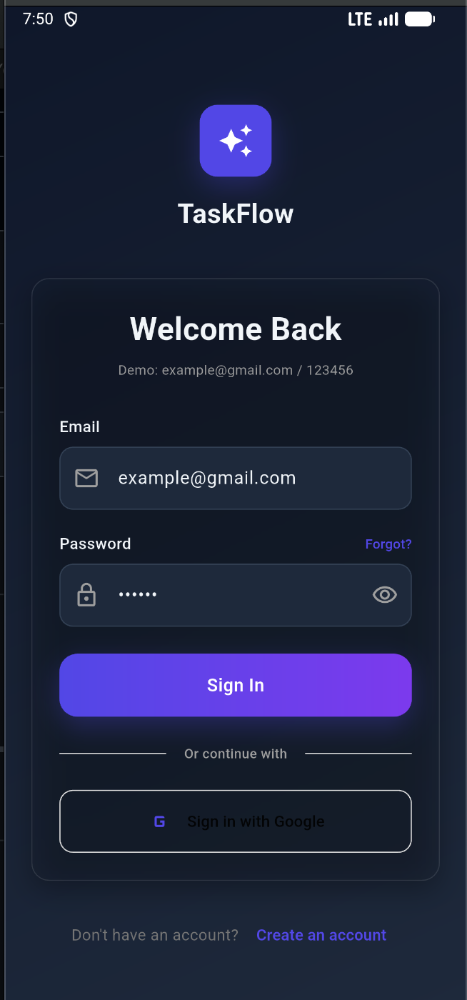
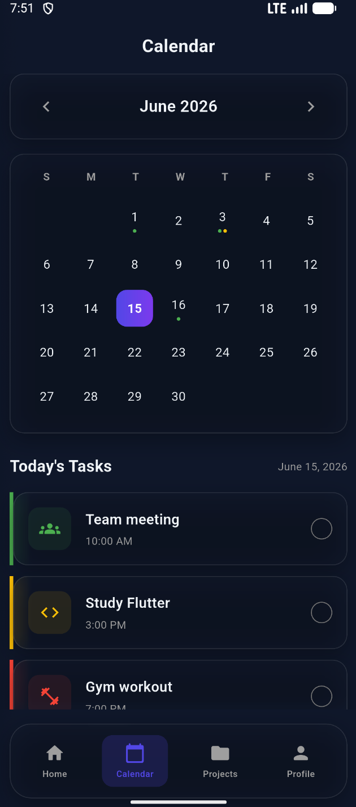
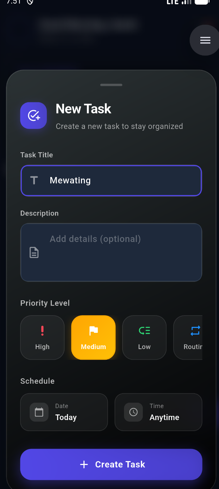

# ✅ Flutter Todo App

Beautiful, fully functional Todo List app built with Flutter.

[](https://flutter.dev)
[](https://dart.dev)
[](LICENSE)

---

## ✨ Features

- ✅ Add, edit, delete tasks
- ✅ Mark complete with animation
- ✅ Swipe to delete
- ✅ Empty state UI
- ✅ Clean, modern design

---

## 📸 Preview

| Login | Add Task | Complete |
|------|----------|----------|
|  |  |  |

---

## 🎥 Watch Tutorial

**YouTube:** [CodeWithAamir-0](https://youtube.com/https://youtube.com/@CodewithAmir-0)

---

## 🚀 Quick Start

```bash
# Clone
git clone https://github.com/Aamirsiddique09/flutter-todo-app.git

# Install
cd flutter-todo-app
flutter pub get

# Run
flutter run
